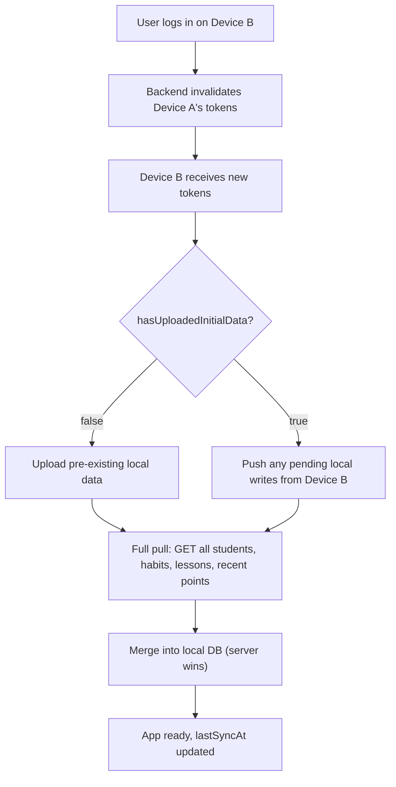

---
name: Backend integration Flutter app (single-device session, local-first)
overview: >
  Flutter app with existing local SQLite. Integrate with Django/DRF backend using JWT,
  but enforce a single logged‑in device at a time (new login invalidates all other tokens).
  Writes are local‑first and pushed to the server when online; offline writes are queued.
  On a new login, the app pulls all server data to sync the local database before the
  user continues. One‑time initial upload of pre‑existing data on first‑ever login.
todos:
  - id: deps_config
    content: >
      Add dio, flutter_secure_storage, connectivity_plus, shared_preferences to pubspec;
      configure Android network_security_config.xml for dev cleartext
    status: pending
  - id: auth_layer
    content: >
      Build AuthCubit, token storage, session management; backend must support token
      revocation (blacklist / versioned tokens). Screens: splash, login, register
    status: pending
  - id: db_migration
    content: >
      Add sync_status, remote_id, last_modified, server_updated_at to all sync‑relevant
      tables; create sync_queue table
    status: pending
  - id: api_layer
    content: >
      Create lib/api/ with Dio + interceptors, DTOs (including updated_at), and service
      classes that support ?updated_since= filtering
    status: pending
  - id: sync_service
    content: >
      Build SyncService: push local queue → pull entire server state (on login) or
      delta (on connectivity trigger) → merge (server wins) → update local DB.
      Implement initial upload flow with ID mapping.
    status: pending
  - id: connectivity
    content: >
      ConnectivityService listens to connectivity_plus and triggers SyncService;
      SyncCubit exposes sync state (idle, syncing, error)
    status: pending
  - id: repos_refactor
    content: >
      All write operations mark local record pending and enqueue sync; reads always
      hit local DB.
    status: pending
  - id: tracking_sync
    content: >
      Tracking screen saves absolute point totals locally, enqueues a batch sync
      operation for the day (points + attendance)
    status: pending
  - id: ui_updates
    content: >
      Home / Settings / Tracking UI: point mode toggle, attendance‑habit picker,
      lesson picker, sync indicator, logout
    status: pending
  - id: initial_upload
    content: >
      On first‑ever login (hasUploadedInitialData == false), push all existing
      local data and store mapped remote IDs; retryable from Settings
    status: pending
  - id: smoke_test
    content: Test login, initial upload, offline entry, switch device, pull, push
    status: pending
isProject: false
---

## 1. Single‑device session policy

- **Only one device can be active.** When a user logs in, the backend invalidates all previously issued refresh tokens for that user. The new device receives fresh access + refresh tokens.
- **On login, pull latest server state.** After a successful login (and initial upload if needed), the app performs a **full sync**: it first pushes any pending local changes (from a previous offline session on *this* device), then pulls *all* server data (students, habits, lessons, and recent points) and merges it into the local database. This guarantees the local state is identical to the server state.
- **Subsequent writes** are local‑first, then pushed to the server when connectivity is available. No other device can write simultaneously, so there are no conflict scenarios.
- **Offline writes** are queued and synced when the network returns; the app does not require the user to be online.

## 2. Dependencies & config

Add to `pubspec.yaml`:

```yaml
dependencies:
  dio: ^5.4.0
  flutter_secure_storage: ^9.2.0
  connectivity_plus: ^6.0.0
  shared_preferences: ^2.2.0
  # existing sqflite / path dependencies remain
  
`BASE_URL` via `--dart-define`:

```dart
static const baseUrl = String.fromEnvironment(
  'BASE_URL',
  defaultValue: 'http://10.0.2.2:8000',
);
```

Android cleartext (debug only):

- Create `android/app/src/main/res/xml/network_security_config.xml`
- Reference it from `android/app/src/debug/AndroidManifest.xml` with `android:networkSecurityConfig`

## 3. Database schema extension

Extend the existing tables (**no data loss**). Use `ALTER TABLE`:

- `sync_status` TEXT NOT NULL DEFAULT 'synced' – `synced`, `pending_create`, `pending_update`, `pending_delete`.
- `remote_id` INTEGER – the server’s ID.
- `last_modified` TEXT – ISO‑8601 of the last local change.
- `server_updated_at` TEXT – the `updated_at` timestamp returned by the server.

New table `sync_queue` for bulk operations:

```sql
CREATE TABLE sync_queue (
  id INTEGER PRIMARY KEY AUTOINCREMENT,
  operation TEXT NOT NULL,        -- 'student_points_sync', 'attendance_create'
  payload TEXT NOT NULL,          -- JSON payload for the API call
  created_at TEXT NOT NULL,
  status TEXT NOT NULL DEFAULT 'pending',
  error_message TEXT
);
```

Store `last_sync_at` in `SharedPreferences`, initially `null`.

## 4. API layer (lib/api/)

- `api_client.dart` – Dio with base URL, JSON, timeouts.
- `auth_interceptor.dart` – adds `Authorization: Bearer <token>` to all except auth‑related paths.
- `token_authenticator.dart` – on 401 `token_not_valid`, uses the refresh token; if that also fails, logs the user out.
- `dto/` – match backend JSON exactly, **include `updated_at` and `is_deleted` on every resource** (see `backend_changes.md`).
- `services/` – `AuthApi`, `UsersApi` (for `GET /api/users/me/`), `StudentsApi`, `HabitsApi`, `StudentPointsApi`, `LessonsApi`, `AttendancesApi`, `HifzApi`. Each resource service must support:
  - Standard CRUD endpoints (full CRUD now exists for students, habits, lessons, hifz; soft-delete for student-points).
  - `getAll({DateTime? updatedSince})` – append `?updated_since=...` when provided. With this param the response includes tombstones (`is_deleted=true`); without it, only live rows are returned.
  - Batch endpoint for daily points: `POST /api/student-points/batch/` with `{date, lesson_id?, entries:[{student_id, habit_id, plus_count, minus_count}]}` — server replaces all rows for that (student, habit, date) with the new absolute counts.

## 5. Auth & session

- **Backend requirements** (see `backend_changes.md` §3, §4):
  - `POST /api/auth/login/` increments the user's `token_version` and embeds it as a JWT claim; any prior tokens fail authentication on the next request.
  - `POST /api/auth/login/refresh/` revalidates `token_version`; mismatched refresh tokens return 401 `token_not_valid`.
  - `GET /api/users/me/` returns the authenticated user — call this immediately after login to populate `UserDto` (the login response only carries access/refresh).
- **Client implementation:**
  - `lib/services/token_storage.dart` – stores tokens in `flutter_secure_storage`.
  - `lib/services/session.dart` – holds tokens and `UserDto` (loaded via `GET /api/users/me/`), `clear()` clears storage.
  - `lib/services/app_mode.dart` – `SharedPreferences` keys: `withPoints`, `attendanceHabitId`, `currentLessonId`, `hasUploadedInitialData`.
  - `AuthCubit` – login, register, logout. On successful login, triggers `SyncService.performLoginSync()`.

## 6. Sync service & login flow

`lib/services/sync_service.dart`

### 6.1 Login sync (`performLoginSync`)

Called by `AuthCubit` after a user logs in:

1. **If `hasUploadedInitialData == false`** → call `initialUpload()` (see below).
2. **Push any pending changes** from the local `sync_queue` and `pending_*` rows (e.g., from a previous offline session on this device). This step is optional but ensures no local writes are lost.
3. **Pull full server state** – because another device may have been active earlier, fetch *all* students, habits, lessons, and points (today’s points or a recent window). Use `GET /api/students/`, `GET /api/habits/`, etc., without `updated_since` for a complete refresh.
4. **Merge:** For each entity type:
   - Match on `remote_id`. If a local row with the same `remote_id` exists, overwrite its fields with the server’s data (server wins). Update `server_updated_at`.
   - If a server row has no corresponding local row, insert it (with `sync_status = synced`).
   - Local rows without `remote_id` (i.e., pending creates that were not yet pushed) are left untouched – they will be pushed later.
5. **Update `last_sync_at`** to `DateTime.now().toUtc()`.
6. Set the UI to “ready”.

### 6.2 Background sync (triggered by connectivity / periodic)

- Push all pending items (same logic as login push).
- Pull delta from server: for each resource, call `getAll(updatedSince: lastSyncAt)`. Merge as above.
- Update `last_sync_at`.

### 6.3 Initial upload

- For every local student that is not yet synced (or all if no `remote_id` exists):
  - `POST /api/students/` with `first_name` / `last_name` (split from `name`), store returned ID and `updated_at`.
- Repeat for habits.
- For local daily entries, compute absolute point totals per student/habit/day, send to batch endpoint (or sequential POSTs) using the now‑mapped `remote_id`s.
- For memorization entries, `POST /api/quran/hifz/` with mapped student IDs.
- Set `hasUploadedInitialData = true`, update `last_sync_at` to now, mark all rows as `synced`.

Run in a modal progress UI; on error, leave flag `false` and allow retry from Settings.

## 7. Repositories – local‑first

Every write method:

1. Saves to SQLite immediately, sets `sync_status = pending_*`, updates `last_modified`.
2. For batch operations (tracking), enqueues a row in `sync_queue`.
3. Calls `SyncService.trySync()` (if online, runs background sync silently).

Reads always query SQLite directly (excluding `pending_delete` rows).

## 8. Daily tracking (with‑points mode)

- The user increments/decrements locally on the Tracking screen; the UI shows absolute totals.
- On save, the repository stores the totals in the local `daily_entries` table and enqueues a `student_points_sync` entry with payload:
  ```json
  {
    "date": "2026-05-02",
    "lesson_id": 12,
    "entries": [
      {"student_id": 5, "habit_id": 2, "plus_count": 3, "minus_count": 0}
    ]
  }
  ```
- The sync service POSTs this to `/api/student-points/batch/`. The server replaces all existing point rows for each `(student, habit, date)` tuple with the new absolute counts inside one transaction (see `backend_changes.md` §5).

## 9. UI updates

- **Tracking screen:** local total display, lesson picker, attendance habit tooltip.
- **Home screen:** `withoutPoints` mode shows attendance tiles; `withPoints` mode shows points tiles.
- **Settings screen:** sync status, “Sync now” button, retry initial upload if needed, mode toggle, attendance habit picker, logout.
- **App bar:** `SyncIndicator` responding to `SyncCubit`.

## 10. Out of scope

- Background sync while the app is killed (only triggers on resume or connectivity change).
- Partial merge of offline points from two devices (impossible by design).
- Conflict UI – the server‑wins merge is automatic.

## 11. Data flow (login on a second device)



Device A, now logged out, will require re‑login and will then go through the same full pull.

## 12. Implementation notes

- All backend prerequisites are tracked in `backend_changes.md` (single-device `token_version`, `updated_at` + `?updated_since=` everywhere, soft delete via `is_deleted`, `GET /api/users/me/`, `POST /api/student-points/batch/`, dated attendance, full CRUD on lessons/hifz). The Flutter integration assumes those changes are deployed first.
- During delta sync, treat any record returned with `is_deleted=true` as a tombstone: remove the matching local row (or skip the insert if it never existed locally).
- The initial upload modal should show progress (e.g., "Uploading students… 5/20") to avoid user frustration.
